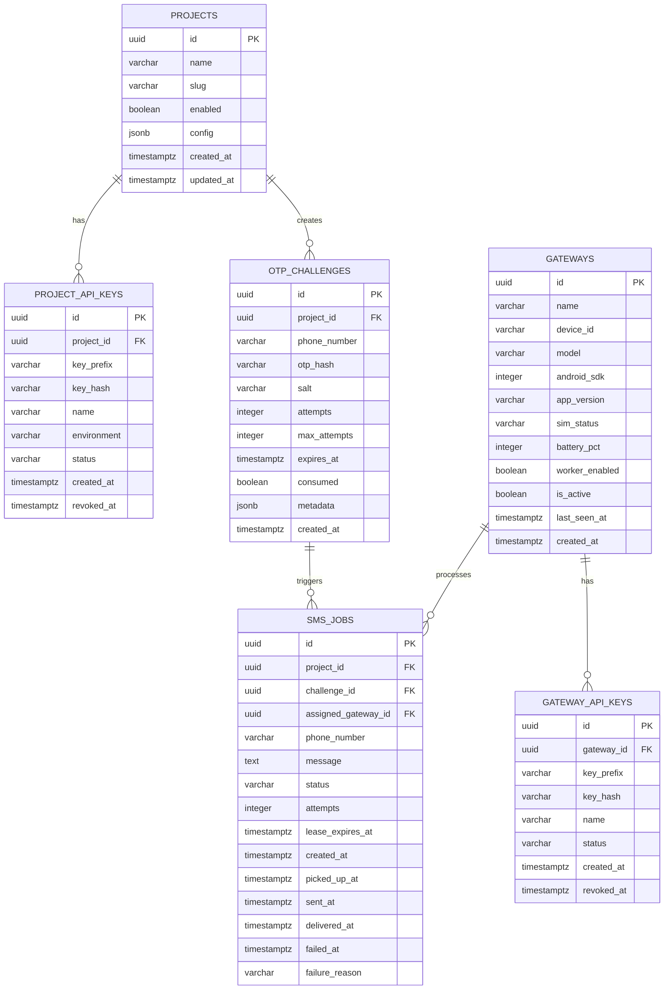

# Swift — Data Model & Schema Proposal

## 1. Relational Entity Overview



---

## 2. Table Definitions & Field Specifications

### 2.1 `projects`
Represents client applications (e.g., CivicFix, Hostix).
- `id` (UUID, Primary Key): Unique identifier.
- `name` (VARCHAR(100), NOT NULL): Human-readable name.
- `slug` (VARCHAR(50), UNIQUE, NOT NULL): URL-safe identifier (e.g., `civicfix`).
- `enabled` (BOOLEAN, DEFAULT TRUE): Master switch for project access.
- `config` (JSONB, DEFAULT '{}'): Rate limit overrides, default OTP expiry, templates.
- `created_at` (TIMESTAMPTZ, DEFAULT NOW()).
- `updated_at` (TIMESTAMPTZ, DEFAULT NOW()).

### 2.2 `project_api_keys`
API credentials issued to projects. Plaintext keys are never stored.
- `id` (UUID, Primary Key).
- `project_id` (UUID, FK -> `projects.id`, ON DELETE CASCADE).
- `key_prefix` (VARCHAR(20), NOT NULL): Public display prefix (e.g., `otp_proj_live_a1b2`).
- `key_hash` (VARCHAR(64), NOT NULL, UNIQUE): SHA-256 hash of the complete plaintext key.
- `name` (VARCHAR(100)): Friendly label (e.g., `CivicFix Production Server`).
- `environment` (VARCHAR(20), DEFAULT 'live'): `live` or `test`.
- `status` (VARCHAR(20), DEFAULT 'ACTIVE'): `ACTIVE`, `REVOKED`, `EXPIRED`.
- `created_at` (TIMESTAMPTZ, DEFAULT NOW()).
- `revoked_at` (TIMESTAMPTZ, NULLABLE).

### 2.3 `otp_challenges`
Tracks OTP tokens and verification attempts.
- `id` (UUID, Primary Key).
- `project_id` (UUID, FK -> `projects.id`, ON DELETE RESTRICT).
- `phone_number` (VARCHAR(20), NOT NULL): E.164 formatted telephone number.
- `otp_hash` (VARCHAR(64), NOT NULL): SHA-256 salted hash of generated numeric token.
- `salt` (VARCHAR(32), NOT NULL): Cryptographically random cryptographic salt.
- `attempts` (INTEGER, DEFAULT 0): Failed validation attempts counter.
- `max_attempts` (INTEGER, DEFAULT 3): Maximum allowed failed verification tries.
- `expires_at` (TIMESTAMPTZ, NOT NULL): Expiry deadline (e.g., +300 seconds).
- `consumed` (BOOLEAN, DEFAULT FALSE): Set `TRUE` upon successful verification.
- `metadata` (JSONB, DEFAULT '{}'): Caller contextual metadata (e.g., user ID, purpose).
- `created_at` (TIMESTAMPTZ, DEFAULT NOW()).

### 2.4 `sms_jobs`
SMS dispatch queue and delivery state machine.
- `id` (UUID, Primary Key).
- `project_id` (UUID, FK -> `projects.id`, ON DELETE RESTRICT).
- `challenge_id` (UUID, NULLABLE, FK -> `otp_challenges.id`, ON DELETE SET NULL).
- `assigned_gateway_id` (UUID, NULLABLE, FK -> `gateways.id`, ON DELETE SET NULL).
- `phone_number` (VARCHAR(20), NOT NULL): Destination phone number.
- `message` (TEXT, NOT NULL): Full rendered SMS body.
- `status` (VARCHAR(20), DEFAULT 'QUEUED', NOT NULL):
  - `QUEUED`: Waiting for an Android gateway worker to pick up.
  - `CLAIMED`: Leased to a gateway worker for transmission.
  - `SENDING`: Worker has passed payload to Android `SmsManager`.
  - `SENT`: Android OS confirmed message radio transmission.
  - `DELIVERED`: Carrier returned SMS delivery receipt intent.
  - `FAILED`: Transmission failed (no cellular signal, invalid number, or terminal carrier error).
  - `EXPIRED`: OTP challenge expired before any gateway worker claimed the job.
- `attempts` (INTEGER, DEFAULT 0): Number of lease claim iterations.
- `lease_expires_at` (TIMESTAMPTZ, NULLABLE): Stale job claim deadline (e.g., claimed + 60s).
- `created_at` (TIMESTAMPTZ, DEFAULT NOW()).
- `picked_up_at` (TIMESTAMPTZ, NULLABLE).
- `sent_at` (TIMESTAMPTZ, NULLABLE).
- `delivered_at` (TIMESTAMPTZ, NULLABLE).
- `failed_at` (TIMESTAMPTZ, NULLABLE).
- `failure_reason` (TEXT, NULLABLE).

### 2.5 `gateways`
Registered Android physical gateway devices.
- `id` (UUID, Primary Key).
- `name` (VARCHAR(100), NOT NULL): Friendly device name (e.g., `Gateway-Pixel-Primary`).
- `device_id` (VARCHAR(100), UNIQUE): Unique hardware installation identifier.
- `model` (VARCHAR(100)): Android device model (e.g., `Pixel 7a`).
- `android_sdk` (INTEGER): Compile/Target SDK version.
- `app_version` (VARCHAR(20)): Android Gateway APK version string.
- `sim_status` (VARCHAR(20)): `READY`, `ABSENT`, `NETWORK_LOCKED`, `ERROR`.
- `battery_pct` (INTEGER): Battery charge level (0-100).
- `worker_enabled` (BOOLEAN, DEFAULT TRUE): Remote override toggle for worker.
- `is_active` (BOOLEAN, DEFAULT TRUE): Master activation flag.
- `last_seen_at` (TIMESTAMPTZ, NULLABLE): Heartbeat / polling timestamp.
- `created_at` (TIMESTAMPTZ, DEFAULT NOW()).

### 2.6 `gateway_api_keys`
API credentials issued specifically to physical Android Gateway devices.
- `id` (UUID, Primary Key).
- `gateway_id` (UUID, FK -> `gateways.id`, ON DELETE CASCADE).
- `key_prefix` (VARCHAR(20), NOT NULL): Display prefix (e.g., `otp_gw_live_c3d4`).
- `key_hash` (VARCHAR(64), NOT NULL, UNIQUE): SHA-256 hash of plaintext gateway key.
- `name` (VARCHAR(100)): Label.
- `status` (VARCHAR(20), DEFAULT 'ACTIVE'): `ACTIVE`, `REVOKED`.
- `created_at` (TIMESTAMPTZ, DEFAULT NOW()).
- `revoked_at` (TIMESTAMPTZ, NULLABLE).

---

## 3. High-Performance Indexing Strategy

1. **Job Queue Polling Index:**
   ```sql
   CREATE INDEX idx_sms_jobs_queued ON sms_jobs (status, created_at) WHERE status = 'QUEUED';
   ```
2. **Stale Lease Recovery Index:**
   ```sql
   CREATE INDEX idx_sms_jobs_stale_claims ON sms_jobs (status, lease_expires_at) WHERE status = 'CLAIMED';
   ```
3. **Key Hash Lookups:**
   ```sql
   CREATE INDEX idx_project_api_keys_hash ON project_api_keys (key_hash, status);
   CREATE INDEX idx_gateway_api_keys_hash ON gateway_api_keys (key_hash, status);
   ```
4. **Active Challenge Lookups:**
   ```sql
   CREATE INDEX idx_otp_challenges_verify ON otp_challenges (id, consumed, expires_at);
   ```
